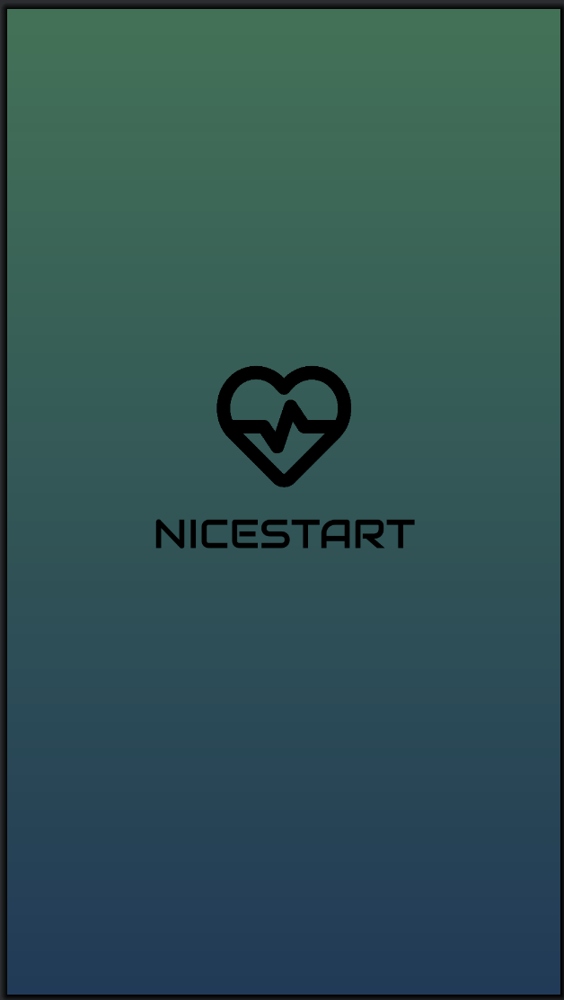

### 🟣 1. Splash Screen

  

- Pantalla inicial de carga antes del acceso al sistema.
- Presenta el nombre de la aplicación y branding visual.
- Funciona como transición hacia Login.

---

### 🔐 2. Pantalla de Login

  

- Formulario de acceso para usuario y contraseña.
- No valida credenciales (maqueta UI sin backend).
- Botón de acceso y enlace directo a Signup.

---

### 📝 3. Pantalla de Registro (Signup)

  

- Interfaz para crear una nueva cuenta.
- Solo maqueta visual, no almacena datos.
- Navegación de vuelta a Login incluida.

---

### 🏠 4. Pantalla Principal (Main)

  

- Vista principal tras el login.
- Incluye:
    - **AppBar (barra superior) con opciones**
        - Menú / Configuración / Cerrar sesión *(dependiendo diseño)*
        - Representa navegación interna futura
    - **WebView funcional**
        - Permite mostrar contenido web embebido dentro de la app

---